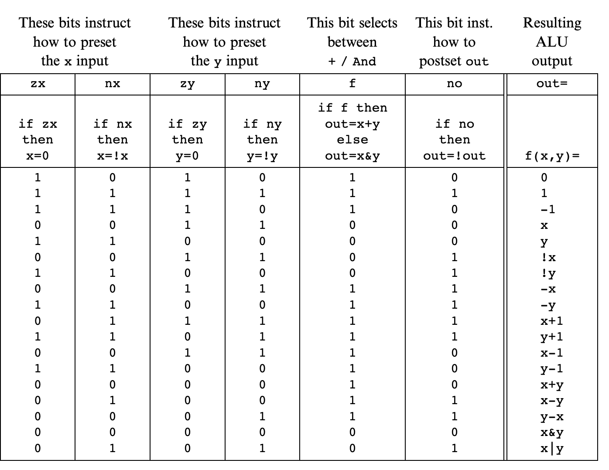

# Boolean Math

## Background

In this project we're going to work through the fundametals needed to take our primitive logic gates and transform them into an ALU (math logic unit).

Whenever possible I'm not going to write the word arithmetic becuase I find it annoying.

We'll find quickly that most of this boils down to making Adders, chips designed to add some number of bits together. Most computer computations can be boiled down to addition of binary units.

### Binary Numbers

Let's take a step back and think about our base10 math then convert that to base 2.

A number like 123 is actually three numbers summed together.

It's `3*10^0 + 2*10^1 + 1*10^2` = 3 + 20 + 100

The formula there is `sum(i=0->n, xi*b^i)`

So let's break down a binary number, 1011.

That's actually

```
1*2^3 + 0*2^2 + 1*2^1 + 1*2^0 = 8 + 2 + 1 = 11
```

The number is larger than our base10, because base 10 carries more information per place in the number. Eventually we'll convert to base8 hexadecimal numbers for exactly this reason.

If 1011 were in a 32 bit machine, it would be stored as
`0000 0000 0000 0000 0000 0000 0000 1011`

### Binary Addition

So just like basic addition, we add numbers from right to left. Another way to phrase that is we add from least significant bit to most significant bit. The rightmost bit is the LSB, the left most is the MSB. Why? Because they represent the most and least amount of information respectively. In our example of 123, the 3rd bit, the 1 in the hundredths spot, carries with it the ability to keep the number 23, or increment it by 100! Definitely more significant than altering it by 0-9.

Just like basic base10 addition, we also carry our remainders over.

If we add 122 and 9, the LSB cannot hold more than data beyond 129 without incrementing the next most significant bit in the tens place. We say we "carry" the one over to the tens place and increment, then spill over the rest of our data into the LSB.

We'll call this carry and overflow.

In binary math it works exactly the same.

```
  1001
+ 0101
=01110

1+1 is 10, so carry the 1 to n1. n0 is 0.
1+0 is 1, so that's n1.
0+1 is 1, so that's n2.
1+0 is 1, so that's n3.

We end up with 1110.

Now with carry.

  1011
+ 0111
=10010

1+1 = 10, so carry the 1. n0 is 0.
1+1+1=11, so carry the 1 and n1 is 1.
1+1=10, so carry the 1 and n2 is 0.
1+1=10, so carry the 1 and n3 is 0.
1+nil=1, so n4 is 1.

10010
```

It should be very clear when you work through the math that there are set conversions happening here in response to input signals. That sounds exactly like our primitive logic gates.

#### Signed Numbers

Before we move on, let's recognize that we've only talked about positive binary numbers, or "unsigned" numbers.

With unsigned numbers we can represent any number in a range from 0-2^n.

How do we represent a negative number?

Well first we have to lose our MSB and now use it to declare whether a number is positive or negative. All positive numbers start with 0, all negative numbers start with 1.

We've now lost that MSB, so we've lost a unit of range. Now our range is (2^n-1)-1 - 2^n-1

To calculate a negative number, let's look at converting 2 to negative 2.

We call this negative number the "complement" of the positive number.

```
xbar = {
    if (x!=0) {
        return 2^n - x
    }

    return 0
}
```

In a 4 bit binary system, 2 is 0010.

So we take 2^4 - 2. So 16 - 2, or 14. We represent 14 in binary and it's 1110.

I have another way of thinking about this.

Starting in base10, back to 123.

If I only have 3 base10 numbers to convey a number, I can go from 0-999.

Each n place in the number can convey everything in its range. So the digits where 23 is can convey 0-99.

When we say 0 is positive and 1 is now negative, we change the formula.

We can now convey data only the with two places.

So we're limited to 0-99 for positive numbers. 00 is still zero.

And we're limited to -1--99 in negative numbers. The most significant bit is telling us which direction to count.

This is allowed because those two bits still contain their whole range.

If MSB=0, you're counting upwards from zero like normal. If MSB=1, you're counting upwards (from a negative to positive sense) and you're starting at the max of your range.

So -1 is 199. -2 is 198, etc.

In binary this translates to using 1s like 0s.

So let's think about four digit binary. 0 is positive. 1 is negative.

0 0000
1 0001
2 0010
3 0011
4 0100
5 0101
6 0110
7 0111

And then when we go negative we're doing a mirrored pattern.

0 is 0000
-1 is 1111
-2 is 1110
-3 is 1101
-4 is 1100
-5 is 1011
-6 is 1010
-7 is 1001
-8 is 1000

If you squint you can see the exact same pattern playing out in both. Instead of carrying 1 on the addition (or subtraction) between each number, you're carrying a 0.

To convert between these and go from like 7 to -7, we do the following.

1. leave all trailing LSB 0s as 0.
2. Leave the first LSB 1 as 1.
3. Then flip all other bits.

In hardware it might be easier to flip all the bits and then add 1.

## Specification

### Adders

We have 3 adders before we get to multibit.

Half-adder: adds two bits.
Full-adder: adds three bits (one of them being the carry)
Adder: adds two n-bit numbers.

We also have a special purpose incrementor that adds 1 to a number.

Chip name: HalfAdder
Inputs: a, b
Outputs: sum, carry
Function: sum = LSB of a + b
carry = MSB of a + b

| x y | carry | sum |
| --- | ----- | --- |
| 0 0 | 0     | 0   |
| 1 0 | 0     | 1   |
| 0 1 | 0     | 1   |
| 1 1 | 1     | 0   |

Chip name: FullAdder
Inputs: a, b, c
Outputs: sum, carry
Function: sum = LSB of a + b + c
carry = MSB of a+b+c

| a b c | carry | sum |
| ----- | ----- | --- |
| 0 0 0 | 0     | 0   |
| 0 0 1 | 0     | 1   |
| 0 1 0 | 0     | 1   |
| 0 1 1 | 1     | 0   |
| 1 0 0 | 0     | 1   |
| 1 0 1 | 1     | 0   |
| 1 1 0 | 1     | 0   |
| 1 1 1 | 1     | 1   |

Chip name: Add16
Inputs: a[16], b[16]
Outputs: out[16]
Function: out = a + b
Comment: Integer 2's complement addition.
Overflow is neither detected nor handled.

Chip name: Inc16
Inputs: in[16]
Outputs: out[16]
Function: out=in+1
Comment: Integer 2’s complement addition.
Overflow is neither detected nor handled.

### ALU

This is where we start getting into the ALU that will be at the core of our computer in the course, Hack.

The Hack ALU will have a fixed number of functions, fi, that it can peform on two n-bit inputs, x and y.

We instruct the ALU which function to run with six input bits called control bits.

In theory we could computer up to 64 different functions, although the book only lays out 18.

```
Chip name: ALU
Inputs: x[16], y[16], // Two 16-bit data inputs
    zx, // Zero the x input
    nx, // Negate the x input
    zy, // Zero the y input
    ny, // Negate the y input
    f, // Function code: 1 for Add, 0 for And
    no // Negate the out output
Outputs: out[16], // 16-bit output
    zr, // True iff out=0
    ng // True iff out<0

Function: if zx then x = 0 // 16-bit zero constant
    if nx
        then x = !x // Bit-wise negation
    if zy
        then y = 0 // 16-bit zero constant
    if ny
        then y = !y // Bit-wise negation
    if f
        then out = x + y // Integer 2's complement addition
    else
        out = x & y // Bit-wise And
    if no
        then out = !out // Bit-wise negation
    if out=0
        then zr = 1 else zr = 0 // 16-bit eq. comparison
    if out<0
        then ng = 1 else ng = 0 // 16-bit neg. comparison

Comment: Overflow is neither detected nor handled.
```



## Implementation

As usual, the implementation is left to us, and simpler is better.

Some hints

- Half adder looks a lot like XOR and AND
- Full adder can be built from two half adders and one additional primitive. Direct implementations are also possible.
- You can do this bitwise in n steps. Add the LSBs and feed the carry on until n-1. Each statement requires 3 bits, the two being added and the carry. This is a ladder of adders. haha. a l-add-adder.
- you can build an incrementer trivially with an n-bit adder.

## Perspective

Again, we're trying to show off concepts here and not go for full ECE efficiency. And efficiency matters, because everything boils down to this chip in the CPU.

A rule of thumb for ALUs is that hardware implementations of math operations beyond addition is more efficient but more costly. That is why we don't have division or multiplication in our ALU. It'd be cool to do these those.
